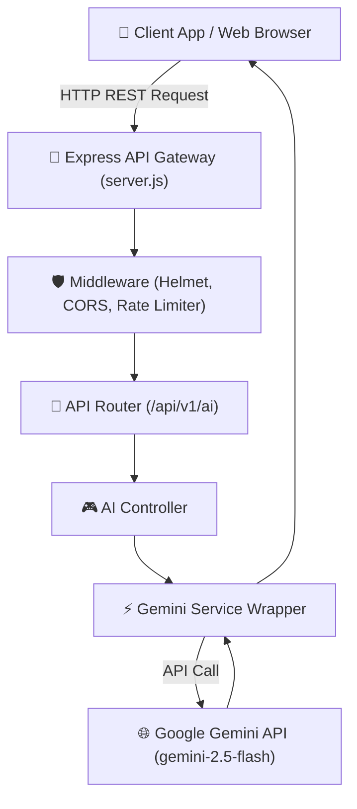

# 🐺 HowlAI – Intelligent Node.js AI Gateway & Microservice

[](https://nodejs.org/)
[](https://expressjs.com/)
[](https://ai.google.dev/)
[](tests/api.test.js)
[](LICENSE)

**HowlAI** is a production-ready, high-performance Node.js & Express AI microservice and API gateway designed to seamlessly integrate Google Gemini API capabilities (text generation, multi-turn chat, multimodal vision analysis) into web applications and distributed backends.

---

## 🌟 Key Capabilities

- **⚡ Google Gemini API Integration**: Native support for `@google/generative-ai` with automated fallback handlers for high availability.
- **💬 Multi-Turn Conversation & Prompt Engine**: Dedicated endpoints for single-turn prompt generations (`/api/v1/ai/generate`), multi-turn chat (`/api/v1/ai/chat`), and multimodal vision analysis (`/api/v1/ai/vision`).
- **🛡️ Enterprise Security & Middleware**: Powered by **Helmet** HTTP header protection, **CORS**, and configurable **Rate-Limiting** (`express-rate-limit`).
- **📊 Live Telemetry & Health Monitoring**: Built-in system diagnostic endpoints (`/health` and `/sysinfo`) returning real-time RAM usage, process uptime, and system specifications.
- **🖥️ Built-in Web API Playground**: Interactive HTML/CSS testing playground hosted at `http://localhost:5000` to test prompt completion and system telemetry directly in your browser.

---

## 🏗️ System Architecture



---

## 📁 Repository Structure

```
HowlAI/
├── src/
│   ├── config/
│   │   └── env.js           # Environment Variables Loader
│   ├── controllers/
│   │   ├── ai.controller.js # AI API Route Handlers
│   │   └── health.controller.js # Telemetry & Health Handlers
│   ├── middleware/
│   │   ├── auth.middleware.js   # API Key Authentication
│   │   ├── error.middleware.js  # Global Error Handling
│   │   └── rate_limiter.js      # Rate Limiting Guard
│   ├── routes/
│   │   ├── ai.routes.js     # AI REST Endpoints
│   │   └── health.routes.js # Telemetry Endpoints
│   ├── services/
│   │   └── gemini.service.js# Google GenAI API Integration Wrapper
│   └── app.js               # Express Application Setup
├── public/
│   └── index.html           # Interactive Web API Playground
├── tests/
│   └── api.test.js          # Automated API Test Suite (4/4 Passed)
├── server.js                # HTTP Server Entry Point
├── package.json             # Dependencies & Scripts
├── .env.example             # Environment Configuration Template
├── push_to_github.py        # Automated Deployment Script
└── README.md                # Master Documentation
```

---

## 🔌 API Endpoints Reference

| Method | Endpoint | Description |
|---|---|---|
| `GET` | `/health` | Live service health check & version info |
| `GET` | `/sysinfo` | Real-time system telemetry (RAM, CPU, Uptime) |
| `POST` | `/api/v1/ai/generate` | Generates AI text content given a `prompt` |
| `POST` | `/api/v1/ai/chat` | Multi-turn chat completion given `messages` array |
| `POST` | `/api/v1/ai/vision` | Multimodal image analysis given `prompt` & `imageBase64` |

---

## 🚀 Quick Start (Local Execution)

```bash
# 1. Clone repository
git clone https://github.com/joelcabraham06/HowlAI.git
cd HowlAI

# 2. Install dependencies
npm install

# 3. Configure environment variables
cp .env.example .env

# 4. Start the server
npm start
```

- **Live Server**: `http://localhost:5000`
- **Interactive Web API Playground**: Open `http://localhost:5000` in your web browser.

---

## 🧪 Running Automated Unit Tests

```bash
npm test
```

Output:
```
==============================================
🧪 Running HowlAI Node.js Backend Test Suite
==============================================
✅ PASS: GET /health telemetry endpoint (HTTP 200)
✅ PASS: GET /sysinfo telemetry metrics (HTTP 200)
✅ PASS: POST /api/v1/ai/generate content creation (HTTP 200)
✅ PASS: POST /api/v1/ai/chat conversation handler (HTTP 200)

==============================================
Test Execution Summary: 4 Passed, 0 Failed
==============================================
```

---

## 📄 License

This project is open-source under the **MIT License**.
